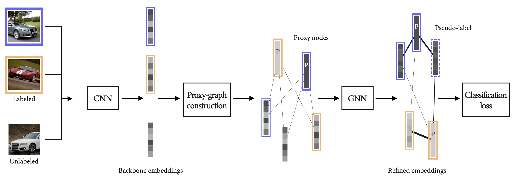

# Graph-based Semi-Supervised Deep Metric Learning

## Abstract
Metric learning is the foundation to various vision-based tasks such as image retrieval, clustering, face verification, or person re-identification. 

Previous research especially focused on designing sophisticated loss functions for measuring similarities. However, we propose a new approach for metric learning which uses a standard cross-entropy loss while leveraging graph neural networks. We introduce a novel graph construction method based on learnable proxy nodes which is applied at runtime for every batch of embedded samples. The graph is then fed into an attention-based GNN to refine those embeddings. Thus, all relations in a batch can be considered and since the proxies act as global learnable parameters, the model can generalize to a global context even beyond the current batch. 

We incorporate semi-supervised learning into our metric learning approach to achieve competitive results for image retrieval and clustering with less annotated data.